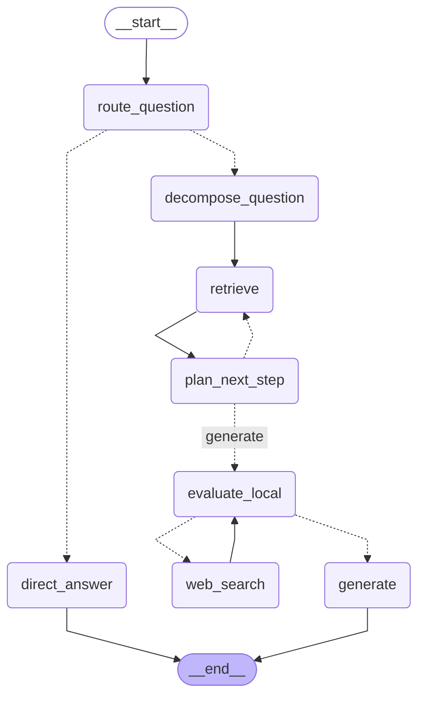

# Agentic RAG 多跳问答系统

基于 **LangGraph (JS)** 实现的 Agentic RAG：由 Agent 自主决策「要不要检索、怎么检索、信息够不够、要不要联网重搜」，而不是一条流水线跑到底。

检索侧最终形态为**混合检索**：Milvus 语义路 + Elasticsearch 关键词路（IK 分词），RRF 融合排序；对外提供 **Express SSE** 流式问答服务。

> **诚实声明（请先读这一段）**：本项目基于一个开源教学课程项目（豆包课程 `agentic_rag`）逐版演进重建而来，不是从零设计的生产系统。课程原版能跑通主线，但存在多处真实缺陷（见 [修复清单](#-修复清单课程原版-10-处)）。本项目保留课程的演进脉络与教学价值，在此基础上：修掉全部已知缺陷、把课程只写了 README 的混合检索真正落地、补齐服务化与工程细节。它适合用来学习 Agentic RAG 的设计思路与 LangGraph 的图编排，不适合直接上生产。

---

## 目录

- [演进脉络](#演进脉络)
- [架构图（v5 终态）](#架构图v5-终态)
- [修复清单（课程原版 10 处）](#修复清单课程原版-10-处)
- [工程增强](#工程增强)
- [快速开始](#快速开始)
- [SSE 服务协议](#sse-服务协议)
- [设计说明](#设计说明)
- [FAQ](#faq)

---

## 演进脉络

五个版本各自独立可运行，`npm run rag:vN` 直接体验：

| 版本 | 文件 | 新增能力 | 图结构 |
| --- | --- | --- | --- |
| v1 | `src/naive-rag.mjs` | 基础流水线：向量检索 → 生成 | 线性，无决策 |
| v2 | `src/rag-query-router.mjs` | 复杂度路由：常识题直答，小说细节题走检索 | 1 个决策点 |
| v3 | `src/rag-multihop.mjs` | 多跳问答：子问题拆解（1~8 条）→ 逐轮检索 → 规划节点决定「继续检索 or 生成」，8 轮硬上限 | 首个循环图 |
| v4 | `src/rag-webfallback.mjs` | 兜底问答：评估节点判断上下文充分性，不足时联网搜索（Bocha）后二次评估（**独立图，不含 v3 的拆解循环**） | 2 个决策点 |
| v5 | `src/rag-v5-final.mjs` | 终态整合：路由 + 拆解 + 迭代检索 + 规划 + 评估 + 联网兜底 + 混合检索 | 8 节点 / 3 个决策点 / 6 条条件边 |

注意 v3 与 v4 是**两条并行的实验分支**（拆解循环 vs 联网兜底），不是功能累加；v5 才把两条线合到一张图里。

## 架构图（v5 终态）



全部 5 张图可用 `npm run graph` 重新导出到 `docs/graphs/`。

## 修复清单（课程原版 10 处）

以下是逐行核对课程原版源码后确认的真实缺陷，本项目全部修复：

| # | 原版问题 | 后果 | 修复 |
| --- | --- | --- | --- |
| 1 | v3 规划后条件边读 `state.strategy`（路由结果，恒为 `complex`）而非 `state.plannedNext` | 循环分支永远走错，规划节点的决策形同虚设 | `afterPlan` 改读 `plannedNext` |
| 2 | v4 写入 `retrieveDocs`、下游读 `retrievedDocs` | 字段错配，检索结果静默丢失 | 统一字段名 |
| 3 | v4 联网搜索 `if (webpages.length) return "未找到相关结果。"` | 判断取反：**有结果时反而返回未找到** | `if (!webpages.length)` |
| 4 | 多处 `catch {` 内引用 `error.message` | catch 未绑定 error，报错时抛 ReferenceError，掩盖真实错误 | `catch (error)` 并绑定引用 |
| 5 | `TOP_K` 在 3 个文件中直接使用但从未声明 | 运行时 ReferenceError | 收敛到 `CONFIG` 统一管理 |
| 6 | v1 的 `OpenAIEmbeddings` 缺 `apiKey` / `baseURL` | 非官方端点下必然 401 | 统一由 `makeEmbeddings` 注入 |
| 7 | v2/v3 用 `.then(err => ...)` 处理错误 | 错误回调写进了成功分支，异常被吞 | 改 `try/catch` |
| 8 | v4 评估结果以 `JSON.stringify` 字符串存入状态，下游反复 `JSON.parse` | 状态类型不稳、解析散落各处 | 直接存对象 |
| 9 | `zod` / `@langchain/textsplitters` / milvus SDK 未声明依赖 | 仅因传递依赖才碰巧能跑 | 显式声明进 `package.json` |
| 10 | 入库用 `insert` 且主键为 `bookId_chapter_chunkIndex`，重复执行直接冲突；且写入建 IVF_FLAT 索引、查询却按 HNSW 搜索 | 「幂等入库」是假的；索引类型不一致 | 改 `upsert`；写入/查询统一 HNSW + COSINE |

## 工程增强

在修复之外，相对课程原版做了这些落地：

- **混合检索真正落地**（课程只写了设计意图的 README）：Milvus 语义路 + ES 关键词路（`ik_max_word` 写入 / `ik_smart` 查询），RRF 融合 `score = Σ 1/(60 + rank)`；入库脚本 Milvus / ES 双写，主键对齐是双路去重的前提
- **三重护栏写在代码而非提示词**：① 检索轮数硬上限（`MAX_RETRIEVALS=8`）② 子问题消费尽强制进入生成 ③ 联网幂等标记（`webSearched` 置位后评估节点必出 generate），且图中没有「联网后回检索」的边，结构上杜绝 `评估→搜索→评估` 死循环
- **共享模块收敛**：状态工厂（`Annotation.Root` 无 reducer 即 last-write-wins，`documents` 整组覆盖）、4 个 zod 结构化 Schema、提示词模板、配置单例、日志工具（「模型建议 vs 最终决定」分开打日志，护栏触发可归因）
- **Express SSE 服务化**：见下文协议
- **联网失败不炸图**：`web_search` 节点失败时错误信息进 `webContext`，由生成节点如实说明

## 快速开始

环境要求：**Node.js >= 20**、Docker。

```bash
# 1. 安装依赖
npm install

# 2. 启动基础设施（etcd + MinIO + Milvus + Elasticsearch/IK，ES 为自建镜像自动 build）
npm run docker:up

# 3. 配置环境变量
cp .env.example .env
#    填写 MODEL_NAME / OPENAI_BASE_URL / OPENAI_API_KEY（任意 OpenAI 兼容端点）
#    v4/v5 需要联网兜底：申请 https://open.bochaai.com 的 BOCHA_API_KEY

# 4. 自备语料：放一本 epub 到 data/ 目录（默认天龙八部，可通过 CORPUS_PATH 换）
#    注意：epub 不入库 git（.gitignore 已排除 *.epub），请使用自备文件

# 5. 入库（向量 + 关键词双写，可重复执行，upsert 幂等）
npm run ingest

# 6. 逐版体验
npm run rag:v1   # 验证：阿朱的结局是什么
npm run rag:v2   # 验证：1+1 等于几（应直答，不走检索）
npm run rag:v3   # 验证：四大恶人分别是谁（应拆解多轮检索）
npm run rag:v4   # 验证：雁门关事件 + 2013 版电视剧集数（本地不够，联网兜底）
npm run rag:v5   # 全链路：路由 + 拆解 + 混合检索 + 评估 + 联网

# 7. 启动 SSE 服务
npm run server
```

## SSE 服务协议

`GET /health` —— 健康检查。

`GET /api/rag/stream?question=...&k=5` —— 流式问答（v5 终态图）。响应为 `text/event-stream`，四类事件：

```
event: node
data: {"node":"route_question","strategy":"complex","routeReason":"涉及小说具体情节...","documents":{"count":0,"samples":[]}}

event: node
data: {"node":"retrieve","retrievalCount":1,"currentQuery":"萧峰的父亲是谁","documents":{"count":10,"samples":[{"id":"1_1_0","chapter_num":1,"score":0.0312}]}}

event: token
data: {"node":"generate","text":"雁门关事件的"}

event: token
data: {"node":"generate","text":"主谋是慕容博"}

event: done
data: {"ok":true}
```

- `node`：节点完成，携带状态摘要（`documents` 只含 count 与前 3 条样本，不传原文）
- `token`：仅转发 `generate` / `direct_answer` 两个回答节点的流式增量，路由/拆解/评估等内部推理不下发
- `error`：图执行异常
- `done`：正常结束

客户端断开时服务端会中止图执行（AbortController），释放 LLM 与检索请求。测试：

```bash
curl -N "http://localhost:3000/api/rag/stream?question=雁门关事件的主谋是谁"
```

## 设计说明

**为什么护栏写代码不写提示词？** 提示词约束是概率性的，模型可以被说服；`if` 不是。轮数上限、子问题消费尽、联网幂等三类终止条件全部由条件边里的确定性代码裁决，日志中「模型建议 vs 最终决定」分开打印，护栏一旦触发可归因。

**两层去重的职责分开。** 单轮内：语义路与关键词路的结果可能命中同一 chunk，由 RRF 融合时归并（主键对齐是前提）；跨轮：不同子问题反复命中同一 chunk，由 `mergeUnique` 按 id 去重、保留更高分。两者混在一起谈会漏掉其中一层。

**为什么 LangGraph 状态不用 reducer？** 本图每个节点写的是「这一步的完整结论」而非「增量」，last-write-wins 语义最简单；代价是 `documents` 这类累积字段必须由节点自己完成 `旧 + 新 → 整组覆盖`，忘记覆盖就会丢数据（原版 bug #2 本质就是这类问题）。

**为什么 ES 写入 `ik_max_word`、查询 `ik_smart`？** 写入切细提高召回，查询切粗提高精度，这是 IK 分词的标准用法。

## FAQ

**Q：语料为什么是 epub？** 课程选了《天龙八部》验证多跳问答（人物关系链天然适合拆子问题）。`.gitignore` 排除了 `*.epub`，仓库不含任何版权文件，换书只需改 `CORPUS_PATH`。

**Q：为什么是 JavaScript 而不是 TypeScript？** 与课程原版保持同构，便于对照 diff 学习；LangGraph 的结构化输出由 zod 约束，类型安全的核心点已覆盖。

**Q：`@langchain/community` 有 deprecated 警告？** Milvus 向量库封装在该包中且与课程版本对齐，保留以减少无关变量。

**Q：v4 和 v3 什么关系？** 两条并行实验分支：v3 验证「拆解 + 循环检索」，v4 验证「评估 + 联网兜底」。v4 的 `local_retrieve` 是单次直查，不含 8 轮循环。v5 合并两者为终态图。

## License & 致谢

[MIT](LICENSE)。

感谢豆包课程的开源教学项目 `agentic_rag`——本项目的演进脉络（naive → router → multihop → webfallback）与提示词措辞沿用自原课程，缺陷修复与工程增强均为本仓库独立完成。
