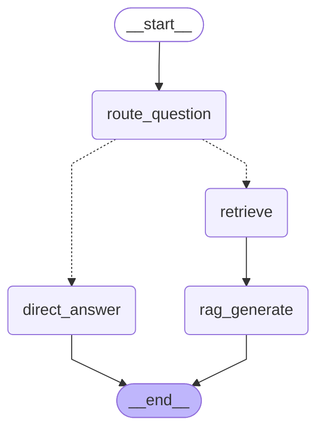

# v2-router

```mermaid
%%{init: {'flowchart': {'curve': 'linear'}}}%%
graph TD;
	__start__([<p>__start__</p>]):::first
	route_question(route_question)
	direct_answer(direct_answer)
	retrieve(retrieve)
	rag_generate(rag_generate)
	__end__([<p>__end__</p>]):::last
	__start__ --> route_question;
	direct_answer --> __end__;
	rag_generate --> __end__;
	retrieve --> rag_generate;
	route_question -.-> direct_answer;
	route_question -.-> retrieve;
	classDef default fill:#f2f0ff,line-height:1.2;
	classDef first fill-opacity:0;
	classDef last fill:#bfb6fc;

```
