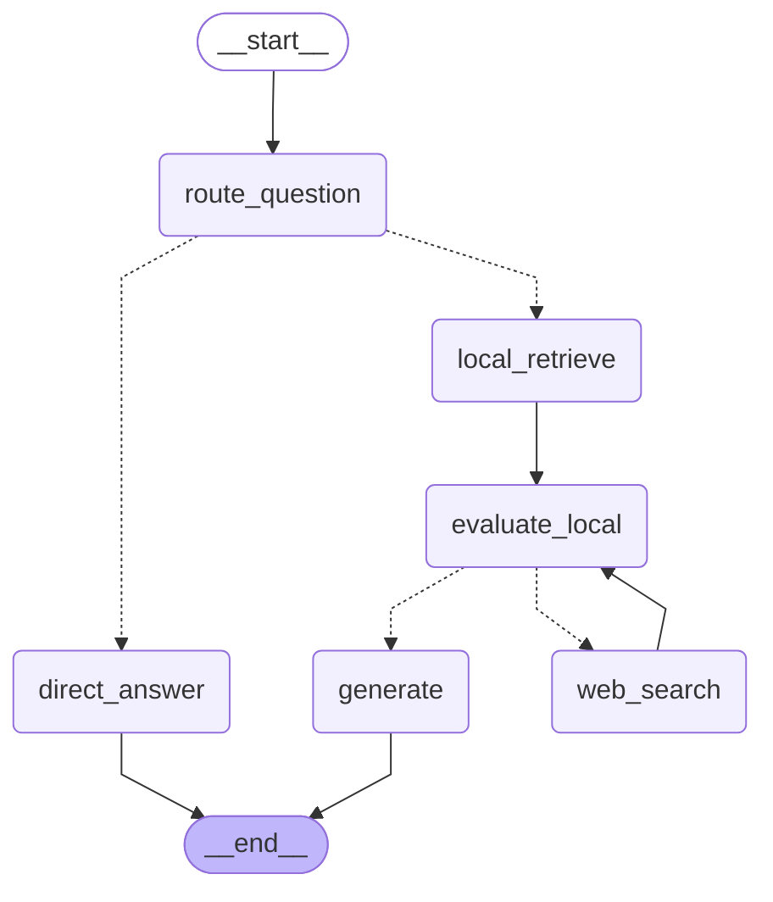

# v4-webfallback

```mermaid
%%{init: {'flowchart': {'curve': 'linear'}}}%%
graph TD;
	__start__([<p>__start__</p>]):::first
	route_question(route_question)
	direct_answer(direct_answer)
	local_retrieve(local_retrieve)
	evaluate_local(evaluate_local)
	generate(generate)
	web_search(web_search)
	__end__([<p>__end__</p>]):::last
	__start__ --> route_question;
	direct_answer --> __end__;
	generate --> __end__;
	local_retrieve --> evaluate_local;
	web_search --> evaluate_local;
	route_question -.-> direct_answer;
	route_question -.-> local_retrieve;
	evaluate_local -.-> generate;
	evaluate_local -.-> web_search;
	classDef default fill:#f2f0ff,line-height:1.2;
	classDef first fill-opacity:0;
	classDef last fill:#bfb6fc;

```
